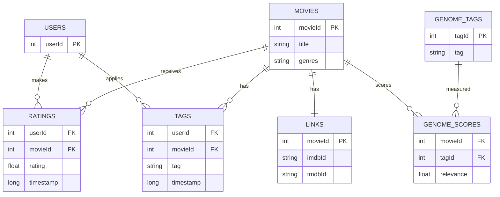

- https://grouplens.org/datasets/movielens/25m/
- https://www.mongodb.com/docs/manual/tutorial/install-mongodb-on-os-x/

## Relational Schema



## Hybrid Normalization

### **1. Movies Collection (`movies.csv`)**

```
{
  _id: ObjectId,// MongoDB auto-generated IDmovieId: Number,// Original movie ID from CSVtitle: String,
  year: Number,// Extracted from titlegenres: [String],// Array of genreslinks: {
    imdbId: String,
    tmdbId: String
  },
  ratings: [// Embedded ratings (optional - could be separate collection){
      userId: Number,
      rating: Number,
      timestamp: Date
    }
  ],
  tags: [// Embedded tags (optional - could be separate collection){
      userId: Number,
      tag: String,
      timestamp: Date
    }
  ],
  genome: [// Tag genome data (optional - could be separate collection){
      tagId: Number,
      tag: String,
      relevance: Number
    }
  ]
}
```

### **2. Ratings Collection (`ratings.csv`)**

```
{
  _id: ObjectId,
  userId: Number,
  movieId: Number,
  rating: Number,// 0.5 to 5.0timestamp: Date,
// Optional reference to movie documentmovie: {
    $ref: 'movies',
    $id: ObjectId
  }
}
```

### **3. Tags Collection (`tags.csv`)**

```
{
  _id: ObjectId,
  userId: Number,
  movieId: Number,
  tag: String,
  timestamp: Date,
// Optional referencesmovie: {
    $ref: 'movies',
    $id: ObjectId
  },
  user: {
    $ref: 'users',
    $id: ObjectId
  }
}
```

### **4. Users Collection (derived from ratings and tags)**

```
{
  _id: ObjectId,
  userId: Number,// Original user ID from CSVratings: [// Embedded ratings (optional){
      movieId: Number,
      rating: Number,
      timestamp: Date
    }
  ],
  tags: [// Embedded tags (optional){
      movieId: Number,
      tag: String,
      timestamp: Date
    }
  ],
  stats: {// Aggregated statsratingCount: Number,
    avgRating: Number,
    firstRatingDate: Date,
    lastRatingDate: Date
  }
}
```

### **5. Genome Tags Collection (`genome-tags.csv`)**

```
{
  _id: ObjectId,
  tagId: Number,
  tag: String
}
```

### **6. Genome Scores Collection (`genome-scores.csv`)**

```
{
  _id: ObjectId,
  movieId: Number,
  tagId: Number,
  relevance: Number,
// Optional referencesmovie: {
    $ref: 'movies',
    $id: ObjectId
  },
  genomeTag: {
    $ref: 'genomeTags',
    $id: ObjectId
  }
}
```

Fully normalize (separate collections for everything) or fully denormalize (embed all related data) depending on your query patterns.

**Embedding vs Referencing**

Embedding ratings/tags in movies if you frequently access movie data with their ratings

Keeping ratings/tags separate if you frequently query ratings/tags independently

**Indexes**: Create indexes on:

- **`movieId`** in all collections
- **`userId`** in ratings and tags collections
- **`timestamp`** fields for time-based queries

Como queremos hacer un sistema de recomendación, lo mojer va a ser embeber todo en in single lookup.

## **Single Document Lookup**

### **1. Movies Collection**

```python
{
  _id: ObjectId, // MongoDB auto-generated ID
  movieId: Number, // Original movie ID from CSV (unique)
  title: String,
  year: Number, // Extracted from title (e.g., "Toy Story (1995)" → 1995)
  genres: [String], // Array of genres (e.g., ["Adventure", "Animation", "Children"])
  
  // External references, we could simply not use these
  links: {
    imdbId: String,
    tmdbId: String
  },
  
  // Tag genome data - embedded directly
  tagGenome: [
    {
      tagId: Number,
      tag: String, // The actual tag description
      relevance: Number // Score between 0-1
    }
  ],
  
  // Optional: Ratings could be embedded or referenced
  ratings: [
    {
      userId: Number,
      rating: Number, // 0.5 to 5.0
      timestamp: Date
    }
  ],
  
  // Optional: Tags could be embedded or referenced
  tags: [
    {
      userId: Number,
      tag: String,
      timestamp: Date
    }
  ]
}
```

### **2. Users Collection**

```
{
  _id: ObjectId,
  userId: Number,// Original user ID from CSVratings: [// Embedded ratings (optional){
      movieId: Number,
      rating: Number,
      timestamp: Date
    }
  ],
  tags: [// Embedded tags (optional){
      movieId: Number,
      tag: String,
      timestamp: Date
    }
  ],
  stats: {// Aggregated statsratingCount: Number,
    avgRating: Number,
    firstRatingDate: Date,
    lastRatingDate: Date
  }
}
```

Get complete movie data (including genome scores) with one query

**Atomic Updates**: All movie data is contained in one document, good for replications

We can add:

- Precompute the mean rating for each movie
- Add user history interacction sequence

## Some Queries

### **1. User Ratings with Movie Details**

This shows how to get user profiles with their rated movies' full details:

python

Copy

Download

```
("User Ratings with Movie Details", lambda: list(db.command('aggregate', 'users', pipeline=[
    {"$match": {"userId": {"$in": list(selected_users[:5])}}},# Sample users{"$lookup": {
        "from": "movies",
        "localField": "ratings.movieId",# Join on movie IDs from ratings"foreignField": "movieId",
        "as": "ratedMovies"
    }},
    {"$project": {
        "userId": 1,
        "ratedMovies": {
            "$map": {
                "input": "$ratedMovies",
                "as": "movie",
                "in": {
                    "title": "$$movie.title",
                    "year": "$$movie.year",
                    "genres": "$$movie.genres",
                    "avgRating": "$$movie.stats.avgRating"
                }
            }
        },
        "ratingCount": {"$size": "$ratings"}
    }},
    {"$limit": 5}
])))
```

### **2. Movies with Their Top Raters**

This finds movies with the users who gave them the highest ratings:

python

Copy

Download

```
("Movies with Top Raters", lambda: list(db.command('aggregate', 'movies', pipeline=[
    {"$match": {"stats.ratingCount": {"$gt": 50}}},# Popular movies{"$lookup": {
        "from": "users",
        "let": {"movie_id": "$movieId"},
        "pipeline": [
            {"$unwind": "$ratings"},
            {"$match": {
                "$expr": {
                    "$and": [
                        {"$eq": ["$ratings.movieId", "$$movie_id"]},
                        {"$gte": ["$ratings.rating", 4.5]}# High ratings]
                }
            }},
            {"$project": {
                "userId": 1,
                "rating": "$ratings.rating",
                "timestamp": "$ratings.timestamp"
            }}
        ],
        "as": "highScorers"
    }},
    {"$match": {"highScorers.0": {"$exists": True}}},# Has at least one high scorer{"$project": {
        "title": 1,
        "year": 1,
        "avgRating": "$stats.avgRating",
        "highScorers": {
            "$slice": [
                {"$sortArray": {
                    "input": "$highScorers",
                    "sortBy": {"rating": -1}
                }},
                5# Top 5 raters]
        }
    }},
    {"$limit": 5}
])))
```

### **3. Genre-Based User Preferences**

This analyzes which genres users rate most highly:

python

Copy

Download

```
("User Genre Preferences", lambda: list(db.command('aggregate', 'users', pipeline=[
    {"$match": {"stats.ratingCount": {"$gt": 20}}},# Active users{"$lookup": {
        "from": "movies",
        "localField": "ratings.movieId",
        "foreignField": "movieId",
        "as": "ratedMovies"
    }},
    {"$unwind": "$ratedMovies"},
    {"$unwind": "$ratedMovies.genres"},
    {"$group": {
        "_id": {
            "userId": "$userId",
            "genre": "$ratedMovies.genres"
        },
        "avgRating": {"$avg": {
            "$arrayElemAt": [
                {"$filter": {
                    "input": "$ratings",
                    "as": "r",
                    "cond": {"$eq": ["$$r.movieId", "$ratedMovies.movieId"]}
                }},
                0
            ]
        }}
    }},
    {"$group": {
        "_id": "$_id.userId",
        "preferredGenres": {
            "$push": {
                "genre": "$_id.genre",
                "avgRating": "$avgRating"
            }
        },
        "count": {"$sum": 1}
    }},
    {"$project": {
        "userId": "$_id",
        "preferredGenres": {
            "$slice": [
                {"$sortArray": {
                    "input": "$preferredGenres",
                    "sortBy": {"avgRating": -1}
                }},
                3# Top 3 genres]
        }
    }},
    {"$limit": 5}
])))
```