# Bases de Datos No Relacionales - FING

## Descripción General

### Objetivo
El propósito de este trabajo es tomar un dominio de datos común y modelarlo utilizando al menos dos enfoques distintos distintos de bases de datos no relacionales, 
con el objetivo de analizar y comparar las ventajas y desventajas que ofrece cada paradigma. 
Esta iniciativa se enmarca dentro de la consigna correspondiente a la Familia 5, titulada "Modelado cruzado o con variantes", 
la cual propone explorar cómo diferentes modelos —como documentales, de grafos, de clave-valor o columnar— abordan la representación, 
el almacenamiento y la consulta de los mismos datos.

Para garantizar una comparación justa y significativa entre los enfoques seleccionados, se busca que las consultas sean conceptualmente equivalentes y que los diseños implementados en cada modelo se ajusten a criterios razonables dentro de su paradigma. 
Asimismo, se llevan a cabo benchmarks específicos que permiten evaluar aspectos clave del rendimiento, como tiempos de respuesta y eficiencia operativa, entre otras métricas relevantes.

### Recursos Utilizados
Para el desarrollo del trabajo se utilizaron las siguientes herramientas y conjuntos de datos:

- **MovieLens 25M**: Conjunto de datos provisto por GroupLens, que contiene 25 millones de calificaciones realizadas por usuarios sobre películas. 
Este dataset sirvió como base común para aplicar los distintos modelos de bases de datos no relacionales. Disponible en: https://grouplens.org/datasets/movielens/25m/

- **MongoDB**: Base de datos orientada a documentos, utilizada para representar los datos en formato JSON de manera flexible y escalable. 
Sempleó la versión para macOS siguiendo la guía oficial de instalación: https://www.mongodb.com/docs/manual/tutorial/install-mongodb-on-os-x/

- **Neo4j**: Base de datos orientada a grafos, empleada para modelar relaciones complejas entre entidades como usuarios, películas y géneros. 
Su modelo basado en nodos y relaciones permite consultas eficientes sobre estructuras de red. Información y descarga disponibles en: https://neo4j.com/download/

## Esquema Relacional

Este esquema modela las interacciones entre usuarios y películas dentro del conjunto de datos MovieLens 25M utilizando una estructura relacional normalizada. 
Define cómo se relacionan las películas, los usuarios, las calificaciones, las etiquetas, los enlaces externos y los datos del Tag Genome:

- `USERS` (Usuarios): Representa a los usuarios que calificaron o etiquetaron películas. Cada usuario está identificado de forma única por userId.
- `MOVIES` (Películas): Contiene información sobre cada película, incluyendo el title (título) y los genres (géneros). Cada película se identifica mediante un movieId.
- `RATINGS` (Calificaciones): Registra las calificaciones que los usuarios asignan a las películas, incluyendo el rating (valor entre 0.5 y 5.0 estrellas) y un timestamp (marca de tiempo). 
Forma una relación muchos-a-muchos entre USERS y MOVIES.
- `TAGS` (Etiquetas): Almacena etiquetas en texto libre que los usuarios aplican a películas, junto con una timestamp. También establece una relación muchos-a-muchos entre USERS y MOVIES.
- `LINKS` (Enlaces): Mapea cada movieId a identificadores externos como imdbId y tmdbId, permitiendo referencias cruzadas con otras bases de datos de películas.
- `GENOME_TAGS` (Etiquetas del Genoma): Es un diccionario que describe las etiquetas (tagId, tag) utilizadas en los puntajes de relevancia del genoma.
- `GENOME_SCORES` (Puntajes del Genoma): Asocia cada movieId y tagId con un valor de relevance, que indica cuán fuertemente una película expresa una determinada etiqueta.

El siguiente diagrama ilustra visualmente este esquema y las relaciones entre sus tablas:

```mermaid
erDiagram
    USERS {
        int userId PK
    }
    
    MOVIES {
        int movieId PK
        string title
        string genres
    }
    
    RATINGS {
        int userId FK
        int movieId FK
        float rating
        long timestamp
    }
    
    TAGS {
        int userId FK
        int movieId FK
        string tag
        long timestamp
    }
    
    LINKS {
        int movieId PK
        string imdbId
        string tmdbId
    }
    
    GENOME_TAGS {
        int tagId PK
        string tag
    }
    
    GENOME_SCORES {
        int movieId FK
        int tagId FK
        float relevance
    }

    USERS ||--o{ RATINGS : "makes"
    USERS ||--o{ TAGS : "applies"
    MOVIES ||--o{ RATINGS : "receives"
    MOVIES ||--o{ TAGS : "has"
    MOVIES ||--|| LINKS : "has"
    MOVIES ||--o{ GENOME_SCORES : "scores"
    GENOME_TAGS ||--o{ GENOME_SCORES : "measured"
```



## Quick Start

1. **Descargar el Dataset**: Descargá el dataset MovieLens 25M desde el sitio oficial.
```
wget https://files.grouplens.org/datasets/movielens/ml-25m.zip
unzip ml-25m.zip
cd ml-25m
```

2. **Iniciar MongoDB**

Instalación (macOS vía Homebrew):
```
brew tap mongodb/brew
brew install mongodb-community@7.0
```
Iniciar el servicio:
```
brew services start mongodb/brew/mongodb-community
```
Verificar que esté corriendo:
```
mongosh
```

3. **Iniciar Neo4j**

Instalación (con Homebrew en macOS):
```
brew install --cask neo4j
```
Iniciar Neo4j Desktop o usar Neo4j en terminal:
```
neo4j console
```

4. **Inicializar Entorno Python con Poetry**

Instalar dependencias:
```
poetry install
```

Ingresar al entorno virtual:
```
poetry shell
```

## Base de Datos Documental

### Normalización Híbrida

Aunque finalmente no se implementó este modelo en el proyecto, se diseñó una estructura de base de datos en MongoDB basada en una normalización híbrida, que combina datos embebidos y referencias según los patrones de acceso esperados.

Este enfoque busca un equilibrio eficiente: al embeber información relacionada dentro del documento de película, se facilita el acceso rápido a metadatos, calificaciones, etiquetas y relevancias, lo cual es ideal para sistemas de recomendación que requieren estos datos de forma conjunta

### Diseño General
- `Películas` (movies): Documento principal. Incluye información como title, genres y links, y puede embeber subdocumentos de ratings, tags y genome para facilitar consultas completas con un solo acceso.
- `Usuarios` (users) : Derivados de los datos de calificaciones y etiquetas. Pueden contener subdocumentos embebidos con historial de interacciones y estadísticas agregadas (por ejemplo, promedio de rating o fechas de primera/última calificación).
- `Calificaciones` (ratings), `etiquetas` (tags) y `genome scores`: También pueden almacenarse en colecciones separadas, si se requieren consultas o agregaciones específicas a nivel global.

### **1. Movies Collection (`movies.csv`)**

```
{
  _id: ObjectId,// MongoDB auto-generated IDmovieId: Number,// Original movie ID from CSVtitle: String,
  year: Number,// Extracted from titlegenres: [String],// Array of genreslinks: {
    imdbId: String,
    tmdbId: String
  },
  ratings: [// Embedded ratings (optional - could be separate collection){
      userId: Number,
      rating: Number,
      timestamp: Date
    }
  ],
  tags: [// Embedded tags (optional - could be separate collection){
      userId: Number,
      tag: String,
      timestamp: Date
    }
  ],
  genome: [// Tag genome data (optional - could be separate collection){
      tagId: Number,
      tag: String,
      relevance: Number
    }
  ]
}
```

### **2. Ratings Collection (`ratings.csv`)**

```
{
  _id: ObjectId,
  userId: Number,
  movieId: Number,
  rating: Number,// 0.5 to 5.0timestamp: Date,
// Optional reference to movie documentmovie: {
    $ref: 'movies',
    $id: ObjectId
  }
}
```

### **3. Tags Collection (`tags.csv`)**

```
{
  _id: ObjectId,
  userId: Number,
  movieId: Number,
  tag: String,
  timestamp: Date,
// Optional referencesmovie: {
    $ref: 'movies',
    $id: ObjectId
  },
  user: {
    $ref: 'users',
    $id: ObjectId
  }
}
```

### **4. Users Collection (derived from ratings and tags)**

```
{
  _id: ObjectId,
  userId: Number,// Original user ID from CSVratings: [// Embedded ratings (optional){
      movieId: Number,
      rating: Number,
      timestamp: Date
    }
  ],
  tags: [// Embedded tags (optional){
      movieId: Number,
      tag: String,
      timestamp: Date
    }
  ],
  stats: {// Aggregated statsratingCount: Number,
    avgRating: Number,
    firstRatingDate: Date,
    lastRatingDate: Date
  }
}
```

### **5. Genome Tags Collection (`genome-tags.csv`)**

```
{
  _id: ObjectId,
  tagId: Number,
  tag: String
}
```

### **6. Genome Scores Collection (`genome-scores.csv`)**

```
{
  _id: ObjectId,
  movieId: Number,
  tagId: Number,
  relevance: Number,
// Optional referencesmovie: {
    $ref: 'movies',
    $id: ObjectId
  },
  genomeTag: {
    $ref: 'genomeTags',
    $id: ObjectId
  }
}
```

## **Single Document Lookup**
Este modelo adopta una estrategia de desnormalización total, embebiendo toda la información relevante de una película —calificaciones, etiquetas y datos del tag genome— en un único documento. 
Está especialmente optimizado para sistemas de recomendación que requieren acceder rápidamente a todos los atributos de una película en una sola consulta, por lo que fue el enfoque elegido para este proyecto.

Centralizar los datos en un solo documento reduce la complejidad de las consultas, mejora el rendimiento y permite actualizaciones atómicas, lo que facilita la consistencia y la replicación.

Es recomendable embeber las calificaciones (ratings) y etiquetas (tags) dentro del documento de película cuando estos datos se consultan conjuntamente, como ocurre habitualmente en sistemas de recomendación.

Para garantizar un rendimiento óptimo, deben ser indexados los campos `movieId`, `userId`, y `timestamp` para permitir consultas eficientes basadas en el tiempo.

## Diseño del Modelo

1. **Colección de Películas** (`movies`)

Cada documento incluye:
- Información básica: `movieId`, `title`, `year`, `genres`
- Datos del genoma de etiquetas (`tagGenome`) embebidos
- Calificaciones (`ratings`) y etiquetas (`tags`) embebidas

Esto permite obtener todo el contexto de una película sin joins ni múltiples búsquedas.

2. **Colección de Usuarios** (`users`)

Cada documento incluye:
- `userId` original
- Historial embebido de `ratings` y `tags` aplicados
- Estadísticas precomputadas: número total de calificaciones, promedio de calificación, primera y última interacción.

### **1. Movies Collection**

```python
{
  _id: ObjectId, // MongoDB auto-generated ID
  movieId: Number, // Original movie ID from CSV (unique)
  title: String,
  year: Number, // Extracted from title (e.g., "Toy Story (1995)" → 1995)
  genres: [String], // Array of genres (e.g., ["Adventure", "Animation", "Children"])
  
  // External references, we could simply not use these
  links: {
    imdbId: String,
    tmdbId: String
  },
  
  // Tag genome data - embedded directly
  tagGenome: [
    {
      tagId: Number,
      tag: String, // The actual tag description
      relevance: Number // Score between 0-1
    }
  ],
  
  // Optional: Ratings could be embedded or referenced
  ratings: [
    {
      userId: Number,
      rating: Number, // 0.5 to 5.0
      timestamp: Date
    }
  ],
  
  // Optional: Tags could be embedded or referenced
  tags: [
    {
      userId: Number,
      tag: String,
      timestamp: Date
    }
  ]
}
```

### **2. Users Collection**

```
{
  _id: ObjectId,
  userId: Number,// Original user ID from CSVratings: [// Embedded ratings (optional){
      movieId: Number,
      rating: Number,
      timestamp: Date
    }
  ],
  tags: [// Embedded tags (optional){
      movieId: Number,
      tag: String,
      timestamp: Date
    }
  ],
  stats: {// Aggregated statsratingCount: Number,
    avgRating: Number,
    firstRatingDate: Date,
    lastRatingDate: Date
  }
}
```

## Base de Datos de Grafos - TODO


