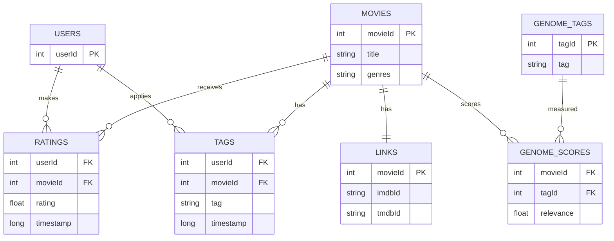
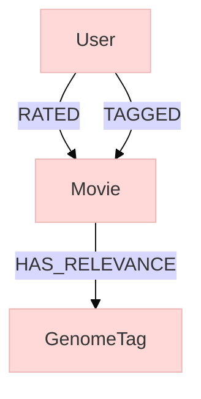

# Bases de Datos No Relacionales - FING

## Descripción General

### Objetivo
El propósito de este trabajo es tomar un dominio de datos común y modelarlo utilizando al menos dos enfoques distintos de bases de datos no relacionales, 
con el objetivo de analizar y comparar las ventajas y desventajas que ofrece cada paradigma.

Esta iniciativa se enmarca dentro de la consigna correspondiente a la Familia 5, titulada "Modelado cruzado o con variantes", 
la cual propone explorar cómo diferentes modelos —como documentales, de grafos, de clave-valor o columnar— abordan la representación, 
el almacenamiento y la consulta de los mismos datos.

Para garantizar una comparación justa y significativa entre los enfoques seleccionados, se busca que las consultas sean conceptualmente equivalentes y que los diseños implementados en cada modelo se ajusten a criterios razonables dentro de su paradigma. 
Asimismo, se llevan a cabo benchmarks específicos que permiten evaluar aspectos clave del rendimiento, como tiempos de respuesta, entre otras métricas relevantes.

### Recursos Utilizados
Para el desarrollo del trabajo se utilizaron las siguientes herramientas y conjuntos de datos:

- **MovieLens 25M**: Conjunto de datos provisto por GroupLens, que contiene 25 millones de calificaciones realizadas por usuarios sobre películas. 
Este dataset sirvió como base común para aplicar los distintos modelos de bases de datos no relacionales. Disponible en: https://grouplens.org/datasets/movielens/25m/

- **MongoDB**: Base de datos orientada a documentos, utilizada para representar los datos en formato JSON de manera flexible y escalable. 
Se empleó la versión para macOS siguiendo la guía oficial de instalación: https://www.mongodb.com/docs/manual/tutorial/install-mongodb-on-os-x/

- **Neo4j**: Base de datos orientada a grafos, empleada para modelar relaciones complejas entre entidades como usuarios, películas y géneros. 
Su modelo basado en nodos y relaciones permite consultas eficientes sobre estructuras de red. Información y descarga disponibles en: https://neo4j.com/download/

## Esquema Relacional

Este esquema modela las interacciones entre usuarios y películas dentro del conjunto de datos MovieLens 25M utilizando una estructura relacional normalizada. 
Define cómo se relacionan las películas, los usuarios, las calificaciones, las etiquetas, los enlaces externos y los datos del Tag Genome:

- `USERS` (Usuarios): Representa a los usuarios que calificaron o etiquetaron películas. Cada usuario está identificado de forma única por userId.
- `MOVIES` (Películas): Contiene información sobre cada película, incluyendo el title (título) y los genres (géneros). Cada película se identifica mediante un movieId.
- `RATINGS` (Calificaciones): Registra las calificaciones que los usuarios asignan a las películas, incluyendo el rating (valor entre 0.5 y 5.0 estrellas) y un timestamp (marca de tiempo). 
Forma una relación muchos-a-muchos entre USERS y MOVIES.
- `TAGS` (Etiquetas): Almacena etiquetas en texto libre que los usuarios aplican a películas, junto con una timestamp. También establece una relación muchos-a-muchos entre USERS y MOVIES.
- `LINKS` (Enlaces): Mapea cada movieId a identificadores externos como imdbId y tmdbId, permitiendo referencias cruzadas con otras bases de datos de películas.
- `GENOME_TAGS` (Etiquetas del Genoma): Es un diccionario que describe las etiquetas (tagId, tag) utilizadas en los puntajes de relevancia del genoma.
- `GENOME_SCORES` (Puntajes del Genoma): Asocia cada movieId y tagId con un valor de relevance, que indica cuán fuertemente una película expresa una determinada etiqueta.

El siguiente diagrama ilustra visualmente este esquema y las relaciones entre sus tablas:



## Quick Start

1. **Descargar el Dataset**: Descargá el dataset MovieLens 25M desde el sitio oficial.
```
wget https://files.grouplens.org/datasets/movielens/ml-25m.zip
unzip ml-25m.zip
cd ml-25m
```

2. **Iniciar MongoDB**

Instalación (macOS vía Homebrew):
```
brew tap mongodb/brew
brew install mongodb-community@7.0
```
Iniciar el servicio:
```
brew services start mongodb/brew/mongodb-community
```
Verificar que esté corriendo:
```
mongosh
```

3. **Iniciar Neo4j**

Instalación (con Homebrew en macOS):
```
brew install --cask neo4j
```
Iniciar Neo4j Desktop o usar Neo4j en terminal:
```
neo4j console
```

4. **Inicializar Entorno Python con Poetry**

Instalar dependencias:
```
poetry install
```

Ingresar al entorno virtual:
```
poetry shell
```

## Base de Datos Documental

Este modelo implementa un enfoque completamente desnormalizado, incorporando toda la información relevante de películas -calificaciones, etiquetas y datos del genoma de etiquetas- dentro de un único documento. 
Este diseño fue seleccionado para nuestro sistema de recomendación ya que permite acceso rápido a todos los atributos de una película mediante una sola consulta.

La centralización de datos en un solo documento:
- Reduce la complejidad de las consultas
- Mejora el rendimiento
- Permite actualizaciones atómicas
- Simplifica la consistencia y replicación

Incorporar calificaciones y etiquetas dentro de los documentos de películas es particularmente ventajoso cuando estos datos se consultan conjuntamente, 
como es común en sistemas de recomendación.

Para un rendimiento óptimo, se deben indexar los siguientes campos:
- `movieId`
- `userId`
- `timestamp`

## Diseño del Modelo de Datos

### 1. **Colección de Películas** (`movies`)

Cada documento incluye:
- Información básica: `movieId`, `title`, `year`, `genres`
- Datos del genoma de etiquetas (`tagGenome`) embebidos
- Calificaciones (`ratings`) y etiquetas (`tags`) embebidas
- Estadísticas precalculadas

Esta estructura proporciona contexto completo de la película sin necesidad de joins o múltiples búsquedas.

**Estructura del Documento:**

```python
{
  "_id": ObjectId,  # ID autogenerado por MongoDB
  "movieId": Number,  # Identificador original de película (único)
  "title": String,
  "year": Number,  # Extraído del título (ej. "Toy Story (1995)" → 1995)
  "genres": [String],  # Arreglo de géneros
  
  # Enlaces de referencia externa (no usados en recomendaciones)
  "links": {
    "imdbId": String,
    "tmdbId": String
  },
  
  # Datos del genoma de etiquetas incorporados
  "tagGenome": [
    {
      "tagId": Number,
      "tag": String,  # Descripción de la etiqueta
      "relevance": Number  # Puntuación de relevancia 0-1
    }
  ],
  
  # Calificaciones de usuarios incorporadas
  "ratings": [
    {
      "userId": Number,
      "rating": Number,  # Escala de 0.5 a 5.0
      "timestamp": Date
    }
  ],
  
  # Etiquetas de usuarios incorporadas
  "tags": [
    {
      "userId": Number,
      "tag": String,
      "timestamp": Date
    }
  ],
  
  # Estadísticas precalculadas
  "stats": {
    "ratingCount": Number,
    "avgRating": Number,  # Redondeado a 2 decimales
    "ratingDistribution": {  # Conteos por nivel de calificación
      "0.5": Number,
      "1.0": Number,
      # ... hasta 5.0
    }
  }
}
```

### 2. **Colección de Usuarios** (`users`)

Cada documento incluye:
- `userId` original
- Historial embebido de `ratings` y `tags` aplicados
- Estadísticas precalculadas sobre actividad del usuario

**Estructura del Documento:**

```
{
  "_id": ObjectId,
  "userId": Number,  # Identificador original de usuario
  
  # Historial de calificaciones incorporado
  "ratingHistory": [
    {
      "movieId": Number,
      "rating": Number,
      "timestamp": Date
    }
  ],
    
  # Estadísticas agregadas del usuario
  "stats": {
    "ratingCount": Number,
    "avgRating": Number,  # Redondeado a 2 decimales
    # "firstRatingDate": Date,  # Disponible en ratingHistory ordenado
    # "lastRatingDate": Date   # Disponible en ratingHistory ordenado
  }
}
```

## Base de Datos de Grafos - TODO

#### Carga general de nodos y relaciones
En nuestro diseño optamos por un modelo intuitivo y expresivo, en el cual representamos como nodos las siguientes entidades:
- User (usuarios)
- Movie (películas)
- Genre (géneros)
- GenomeTag (etiquetas genéticas del contenido)

Y por otra parte, definimos las siguientes relaciones:
- RATED $\rightarrow$ un usuario califica una película
- HAS_GENRE $\rightarrow$ una película tiene uno o más géneros asociados
- TAGGED $\rightarrow$ un usuario asigna un tag textual a una película
- HAS_RELEVANCE $\rightarrow$ una película está asociada a etiquetas (GenomeTag) con un score de relevancia
graph TD



## Benchmark

### Metodología de Evaluación

Implementaremos un sistema de benchmarking para medir el rendimiento de nuestros modelos de base de datos. El benchmark se centrará en:
1. **Rendimiento de consultas**: Tiempos de respuesta para operaciones típicas
2. **Consumo de recursos**: Uso de CPU, memoria y I/O
3. **Estabilidad del sistema**: Comportamiento bajo carga sostenida

### Métricas Clave a Medir

1. **Latencia Total** (`wall_ms`)
- Mide el tiempo real total por consulta (incluyendo cliente, servidor y red)
- Refleja la experiencia real del usuario final


2. **Latencia del Controlador** (`driver_ms`)
- Mide el tiempo reportado por el controlador de la base de datos
- Permite aislar el tiempo real del servidor, excluyendo el procesamiento del lado del cliente

3. **Uso de CPU del Sistema** (`sys_cpu_pct`)
- Mide el porcentaje de utilización de CPU durante las consultas
- Identifica cuellos de botella de procesamiento

4. **Uso de Memoria del Sistema** (`sys_mem_pct`)
- Mide el porcentaje de memoria RAM utilizada
- Detecta problemas de saturación de memoria

5. **Memoria RSS de MongoDB** (`mongo_mem_rss`)
- Mide la memoria física utilizada por el proceso de MongoDB
- Muestra el footprint de memoria real del servidor

6. **Fallos de Página Mayores** (major_faults)
- Mide accesos a disco por falta de páginas en memoria
- Indica problemas de I/O
